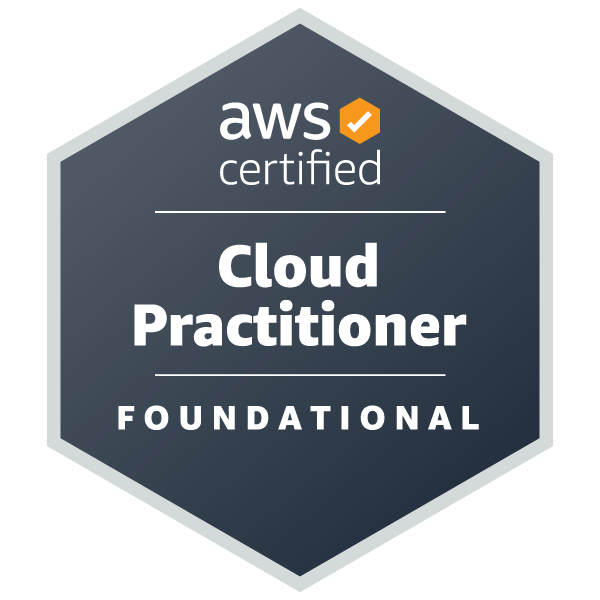

# What's CLF-C-02

## Background Introduction
The **AWS Certified Clud Partitioner (CLF-C02) is an entry-level certification that provides foundational knowledge of the AWS Cloud. It's designed for individuals who want to demostrate their understanding of AWS's core services and concepts without the need for deep technical expertise. 

--- 

## AWS Certified Cloud Practitioner (CLF-C02) Overview 
* Duration: 90 minutes 
* Number of Questions: 65 multiple-choice questions 
* Passing Score: 700 out of 1000 (scaled score)
* Exam Cost: $100 USD
* Language Available: English, Japanese, Korean, and Simplifed Chinese 

--- 

## Core Topics and Weight Distribution 
The exam is structured around four key domains, and each domain has a specific percentage of the total questions: 

### Cloud Concepts (26%)

### Security and Compliance (25%)

### Technology (33%)

### Billing and Pricing (16%)

## References 
* [Ultimate AWS Certified Cloud Practitioner CLF-C02](https://www.udemy.com/course/aws-certified-cloud-practitioner-new/?srsltid=AfmBOopZ0pIzA7T_PJJFH_9huM5oVFqAdQ4tWcBnDMTUsHzgDZHyMAhC)
