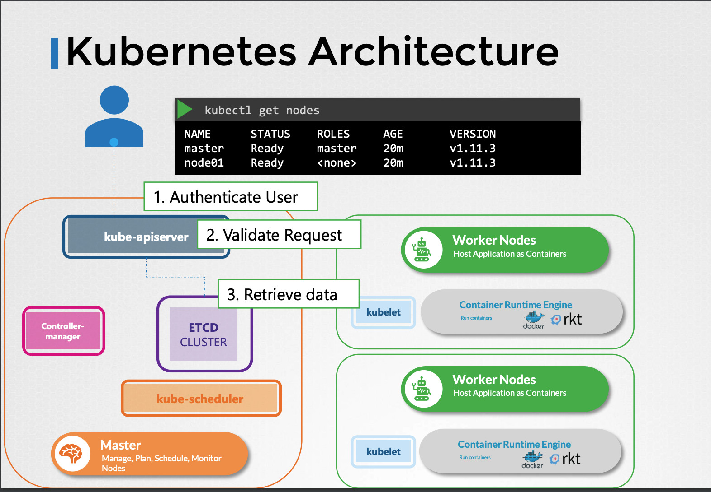
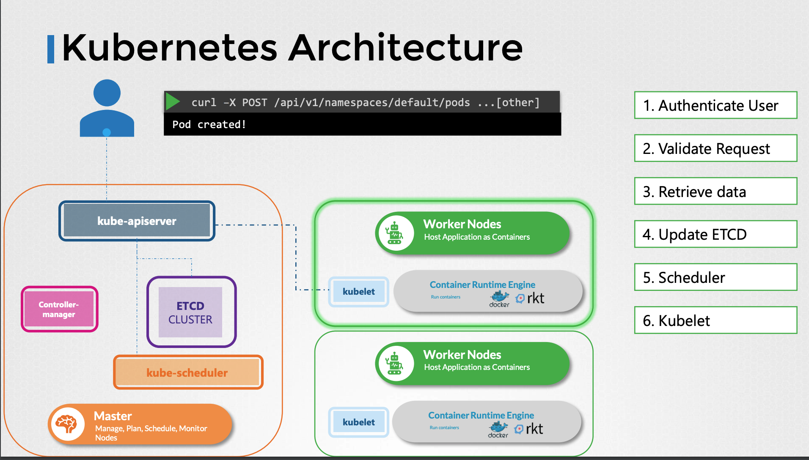

# Kube-API Server 

## What's Kube-api Server in K8S ? 

* kube-api server is the only service that interact directly with the ETCD datastore. 

* Authenticate User 
* Validate Request 
* Retrieve Data 
* Update ETCD 
* Scheduler 
* Kubelet 