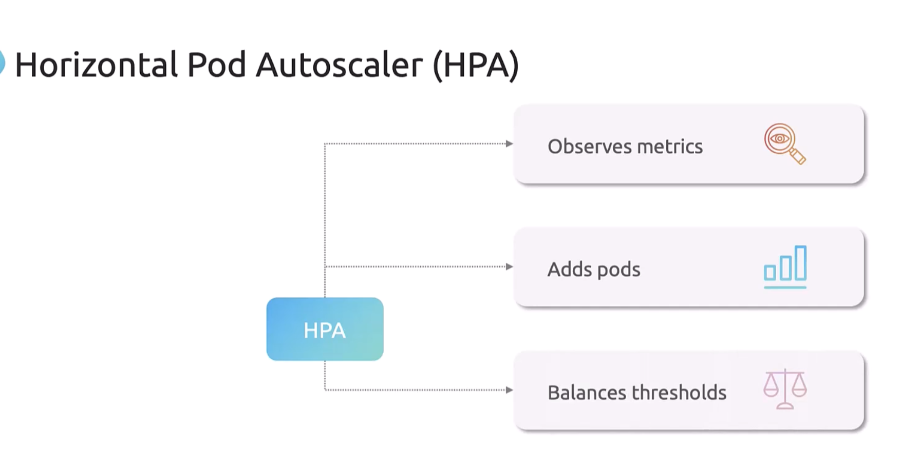

# Autoscaling in CKA

## Scaling a workload the manual way

```yaml
apiVersion: apps/v1
kind: Deployment
metadata:
  name: my-app
spec:
  replicas: 1
  selector:
    matchLabels:
      app: my-app
  template:
    metadata:
      labels:
        app: my-app
    spec:
      containers:
        - name: my-app
          image: nginx
          resources:
            requests:
              cpu: "250m"
            limits:
              cpu: "500m"
```

- Everytime before we scale a workload in a manual way, we usually use command to check the actual resource consumptions
  of current pods.

```shell
kubectl top pod my-app-pod 
```

- After this, we rely on our previous experiences that, we need to scale up our pods from previous 3 to 5, then we
  execute the command below:

```shell
kubectl scale deployment my-app --replicas=3
```

## Horizontal Pod Autoscaling (HPA)

- Diagram shows how HPA work
  

- Commands to implement HPA(horizontal pod autoscaling)
  This means that when deployment of my-app's resource of cpu attach to 0.5 * limits value(500m) -> 250,
  the k8s gonna trigger HPA(horizontal pod autoscale) set the replica numbers at least add 1, at most add 10 pods to the
  deployment.

```shell
kubectl autoscale deployment my-app \
  --cpu-precent=50 --min=1 --max=10
```

- Tip: HPA comes in built-in with Kubernetes since version 1.23


