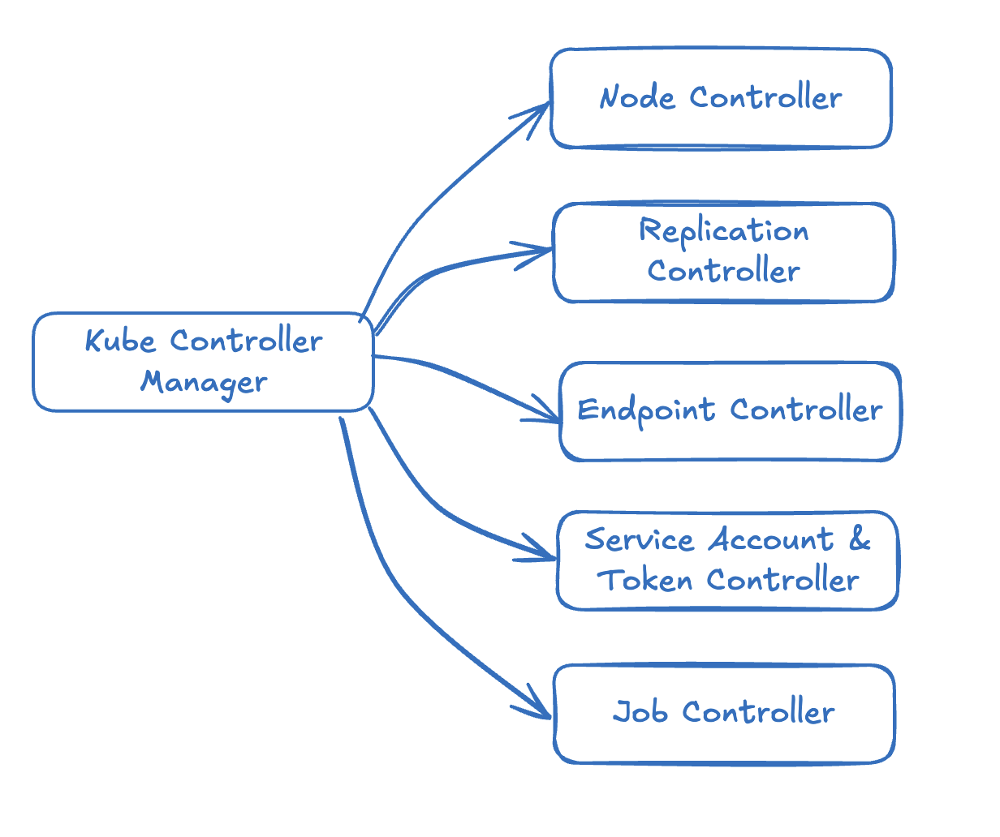

# Kube Controller Manager 

## What's Kube-Controller-Manager ? 

A core component in Kubernetes that runs controllers to manage the cluster state. 

## What's Kube-Controller-Manager's Responsibility in K8S ? 
It runs all controllers in Kubernetes that ensure the cluster matches the desired state. It constantly monitors the cluster and take automatic actions to maintain stability. 




## 01 Node Controller
- Watch the status of the nodes and taking necessary actions to keep the applicaiton running via the kube-apiserver.
- Node Controller checks the status every **5 seconds** to monitor the health of the nodes. 
- If it cannot receive the heart beat from the nodes for 40 seconds, it will mark the nodes as **UNREACHABLE**. 
- After a Node is marked **UNREACHABLE**, the Node Controller gives it ** 5 minutes** to come back, if the Node failed to come back it will be removed and the pods on that **UNREACHABLE** node will be migrate to health ones. 


## 02 Replication Controller 
- Responsible for monitoring the status of replica sets and ensuring that the desired number of pods are available at all times within the sets.
- If monitored pods in the replicasets dies, the replication controller will re-start a new one. 


## 03 Deployment Controller 
- Manages the deployment of applications by ensuring the desired number of replicas are running. 
- The Deployment Controller continuously monitors the status of the deployed pods and ensures they match the desired state specified in the deployment configuration.
- If a pod fails, the controller will automatically replace it with a new pod to meet the desired replica count. 


## 04 StatefulSet Controller 
- Ensure the management of stateful applications that requires persistent storage and ordered deployment. 
- StatefulSets are used for applications that need stable network identities and storage access restarts. 
- If a pod failes, it is replaced in a specific, controlled order, preserving the identity and storage of each pod. 

## 05 Job Controller 
- Manages batch jobs that need to run to completion and ensures that a specified number of pods successfully complete their task. 
- Once a pod completes its task successfully, the Job Controller ensures no further pods are started unless specified otherwise.
- If a pod failes, it will be retried unti the job completes successfully or the retry limit is reached. 

## 06 CronJob Controller 
- Similar to a Job Controller but triggers jobs at specific times or intervals, typically used for scheduled tasks. 
- The CronJob Controller schedules the execution of jobs based on cron-style expressions and ensures that the job completes as expected. 
- If a scheduled job failes, it will be retried based on the defined retry policy. 


## View kube-controller manager 


```bash 
kubectl get pods -n kube-system 
```

# Vie kube-controller manager options - kubeadm 

```bash 
cat /etc/kubernetes/manifests/kube-controller-manager.yml 

spec:
  container:
  - commands: 
    - kube-controller-manager
    - --address=127.0.0.1
    - --cluster-signing-cert-file=/etc/kubernetes/pki/ca.crt
    - --cluster-signing-key-file=/etc/kuberntes/pki/ca.key 
    - --controllers=*,bootstrapsigner,tokenclearner
    - --kubeconfig=/etc/kuberntes/controller-manager.conf 
    - --leader-elect=true 
    - --root-ca-file=/etc/kubenetes/pki/ca.crt
    - --service-account-private-key-file=/etc/kubenetes/pki/sa.key
    - --use-service-account-credentials=true 
```