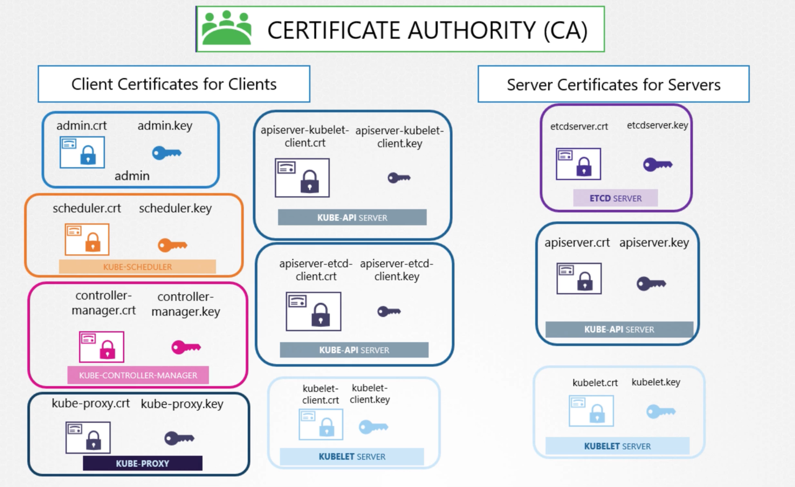
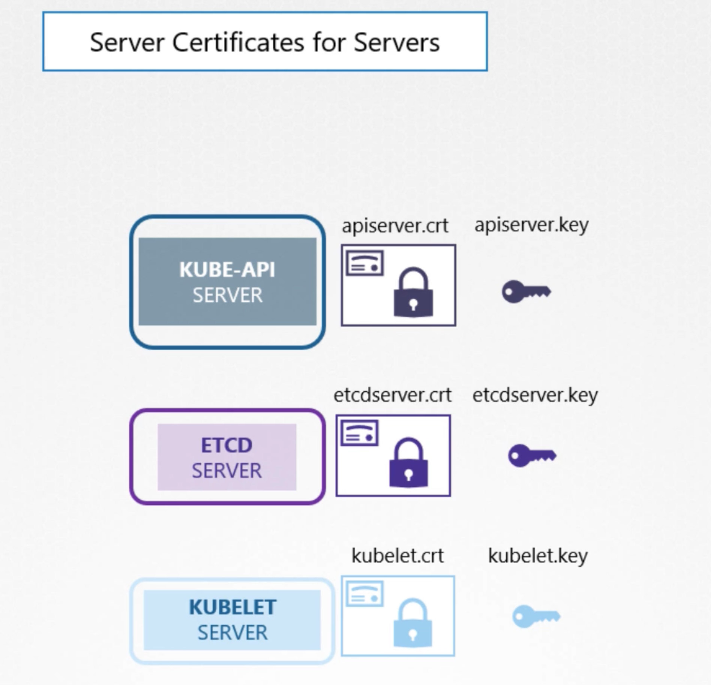
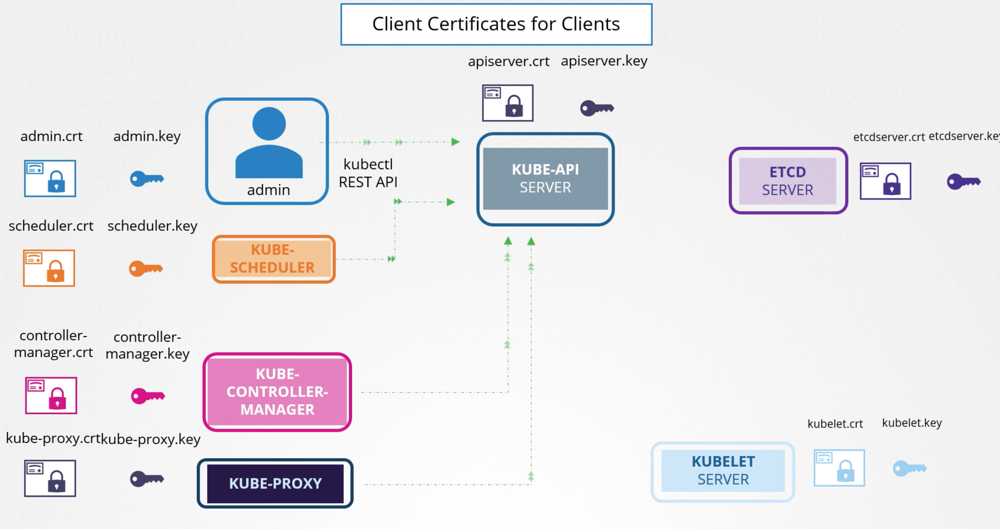

# TLS in Kubernetes

## Server Certificates for Servers

### KUBE-API Server

- apiserver.crt
- apiserver.key

### ETCD Server

- etcdserver.crt
- etcdserver.key

### KUBELET

- kubelet.crt
- kubelet.key

## Client Certificates for Clients

### Admin as A Client

- admin.crt
- admin.key

- When we use `kubectl` commands to communicate with KUBE-API Server as a client, and the **Kubernetes API Server** is
  the server.

- The API server needs to verify **who I am** and **whether I have permission** to access resources like `ConfigMaps`.
- To do this, the API server checks my **client certificate(admin.crt)** and **private key(admin.key)**.

_admin.crt is not a public key, but a client certificate that contains the public key signed by the Kubernetes CA._

### KUBE-Scheduler as A Client

- scheduler.crt
- scheduler.key

### KUBE-Controller Manager as A Client

- controller-manager.crt
- controller-manager.key

### KUBE-Proxy as A Client

- certificate file: kube-proxy.crt
- private key file: kube-proxy.key

### KUBE-API Server Kubelet Client

- apiserver-kubelet-client.crt -- certificate file
- apiserver-kubelet-client.key -- private key

### KUBE-API Server Etcd Client

- apiserver-etcd-client.crt -- certificate file
- apiserver-etcd-client.key -- private key

### KUBE-Kubelet Client

- kubelet-client.crt -- certificate file
- kubelet-client.key -- private key 

